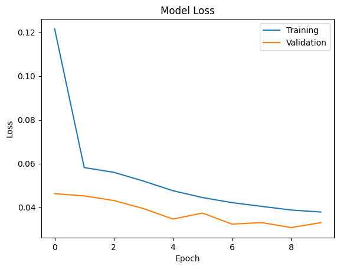

# Self-Driving Car: Behavioral Cloning in the Udacity Simulator

[](https://www.python.org/downloads/release/python-3100/)
[](https://www.tensorflow.org/)
[](https://github.com/udacity/self-driving-car-sim)

---

## 🚗 Introduction

This project demonstrates an end-to-end deep learning pipeline for behavioral cloning using the Udacity self-driving car simulator. The goal is to train a neural network to predict steering angles from camera images, enabling a virtual car to autonomously drive around a simulated track.

---

## 📖 Description

- **Data Collection:** Drive in the Udacity simulator to collect images and steering data.
- **Data Processing:** Balance, augment, and preprocess the data for robust model training.
- **Model Training:** Use a convolutional neural network (NVIDIA architecture) to learn steering commands from images.
- **Autonomous Driving:** Deploy the trained model to control the car in the simulator in real time.

---

## 🖼️ Visuals

<!-- Add screenshots or GIFs here -->


<!-- You can use animated GIFs for the car driving autonomously -->

---

## ⚙️ Prerequisites / Requirements

- **OS:** Linux (simulator binary provided), but simulator is available for Windows/Mac [here](https://github.com/udacity/self-driving-car-sim)
- **Python:** 3.10
- **Conda** (recommended) or `venv`
- **GPU:** Recommended for faster training (CUDA-compatible)
- **Simulator:** Udacity Self-Driving Car Simulator v1.x

Install Python dependencies:
```bash
pip install -r requirements.txt
```

---

## 🛠️ Technologies Used

- Python 3.10
- TensorFlow 2.8+ & Keras
- OpenCV
- imgaug
- Flask + python-socketio (for real-time server)
- Matplotlib, Pandas, scikit-learn

---

## 🚀 QuickStart Guide

1. **Clone the repository:**
   ```bash
   git clone https://github.com/yourusername/self-driving-car-simulation.git
   cd self-driving-car-simulation
   ```

2. **Create and activate the environment:**
   ```bash
   conda create -n car python=3.10
   conda activate car
   pip install -r requirements.txt
   ```

3. **Download and run the simulator:**
   - Use the provided Linux binary in `simulator-linux/Default Linux desktop Universal.x86_64`
   - Or download for your OS [here](https://github.com/udacity/self-driving-car-sim) (choose version 1)

4. **Collect data:**
   - Open the simulator, select **Training Mode** and a track.
   - Set graphics preferences.
   - Create a new data folder.
   - Click **Record**, select your data folder, and drive 3 laps in each direction.
   - Stop recording when done.

5. **Train the model:**
   - Open `notebooks/behavioral_cloning.ipynb` and run all cells.
   - The model will be saved to `model/model.h5`.

6. **Run the inference server:**
   ```bash
   python drive.py
   ```
   - In the simulator, select **Autonomous Mode**. The car should drive itself!

---

## ⚡ Advanced Usage

- **Data Augmentation:** Modify augmentation functions in the notebook for more robust training.
- **Model Architecture:** Try deeper models, add dropout, or experiment with batch normalization.
- **Hyperparameter Tuning:** Adjust learning rate, batch size, and epochs for better results.
- **Custom Tracks:** Collect and train on new tracks for improved generalization.

---

## ⚙️ Configuration

- **Model path:** By default, expects `model/model.h5`.
- **Speed limit:** Set in `drive.py` (`speed_limit` variable).
- **Simulator port:** Default is `4567`.

---

<!-- ## 🧪 Automated Test

- Unit tests for preprocessing and augmentation can be added in a `tests/` folder.
- To test the pipeline, run the notebook end-to-end and verify the car drives autonomously.

--- -->

## 🗺️ Roadmap

- [ ] Add more advanced data augmentation (shadows, perspective, etc.)
- [ ] Support for multiple tracks and weather conditions
- [ ] Integrate with other simulators (e.g., CARLA)
- [ ] Add automated evaluation metrics and test suite

---


## 🤝 Contribution

Contributions are welcome! Please see [CONTRIBUTING.md](./CONTRIBUTING.md) for detailed guidelines on how to get involved, including:

- How to fork, branch, and submit a pull request
- Code style and documentation standards
- How to report issues and request features
- Code of conduct and community expectations

For major changes, please open an issue first to discuss what you would like to change. Thank you for helping make this project better!

---

## 📂 Folder Structure

```
self-driving-car-simulation/
│
├── simulator-linux/           # Simulator binary (Linux)
├── data/                      # Collected driving data
├── model/                     # Saved models
├── notebooks/
│   └── behavioral_cloning.ipynb  # Main training notebook
├── drive.py                   # Inference server
├── requirements.txt
├── README.md
└── ...
```

---

## 📚 References

- [NVIDIA End-to-End Learning for Self-Driving Cars (Paper)](https://arxiv.org/abs/1604.07316)
- [Udacity Self-Driving Car Simulator](https://github.com/udacity/self-driving-car-sim)

---

## 📝 License

MIT License (add your LICENSE file for details)
