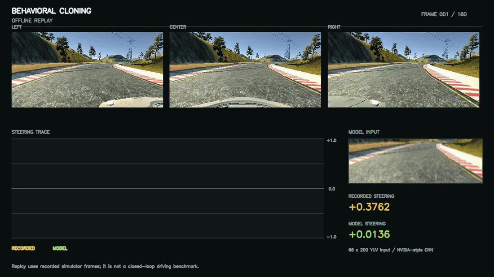
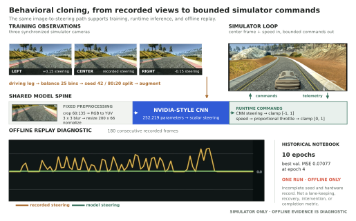

# Self-Driving Car Simulation

[](https://github.com/ethanvillalovoz/self-driving-car-simulation/actions/workflows/ci.yml)
[](https://www.python.org/)
[](LICENSE)

I came back to an old Udacity behavioral-cloning project and made it inspectable again. The restored path trains on center and side-camera telemetry, serves bounded controls through the legacy Socket.IO client, and can replay exactly what the model saw offline.

[](docs/media/self-driving-offline-replay.mp4)

The 7.5-second replay uses the restored release model and 180 consecutive simulator records. It keeps the cameras in left-center-right order, shows the true center frame after `66 x 200` preprocessing, and compares recorded steering with the model prediction. Treat it as an offline diagnostic, not a closed-loop driving benchmark. The tracked [MP4](docs/media/self-driving-offline-replay.mp4) and [poster](docs/media/self-driving-offline-replay.webp) preserve the source capture.

## System At A Glance

[](docs/media/behavioral-cloning-overview.pdf)

The overview separates the maintained training and runtime paths from the evidence that is
actually preserved. Its camera, model-input, steering-trace, and simulator panels come from
committed project media; its numerical record comes from the original notebook extraction.
The replay remains an offline diagnostic rather than a closed-loop result. [Vector
PDF](docs/media/behavioral-cloning-overview.pdf) · [figure contract and
provenance](docs/figures/behavioral-cloning-overview/) · [legacy editable
flow](docs/media/training-and-inference.excalidraw)

| Evidence | Recorded value |
| --- | ---: |
| Model size | 252,219 trainable parameters |
| Input tensor | `66 x 200 x 3` YUV |
| Original run | 10 epochs, historical notebook workflow |
| Best recorded validation MSE | `0.07077` at epoch 4 |
| Runtime target | Udacity simulator on port `4567` |

The loss value comes from the committed historical notebook output. It is evidence that the training path ran, not a lane-keeping benchmark. No track-completion rate, intervention count, recovery metric, or real-world driving result was recorded, so this repository does not claim one.

The exact extracted values are preserved in [`examples/original-run-metrics.json`](examples/original-run-metrics.json).

## What Changed In 1.1

- Moved preprocessing, control, training, downloads, and serving into an installable `src/` package.
- Added deterministic balancing and train/validation splits with an explicit seed.
- Bounded image payloads, steering, and throttle; malformed telemetry fails to a neutral command.
- Corrected Socket.IO responses to target the connected simulator session.
- Added SHA-256 verification and link-safe extraction for every release artifact.
- Preserved the original notebook as an exploratory record while making scripts authoritative.
- Added focused tests for image handling, control safety, data preparation, and archive extraction.

## Quick Start

### Verify The Core

```bash
git clone https://github.com/ethanvillalovoz/self-driving-car-simulation.git
cd self-driving-car-simulation
python3 -m venv .venv
source .venv/bin/activate
pip install -e ".[dev]"
ruff check src tests scripts drive.py
pytest -q
```

### Run Autonomous Mode

The pinned Socket.IO versions preserve compatibility with the older simulator client.

```bash
pip install -e ".[simulator]"
self-driving-artifacts --model
self-driving-drive --model model/model.h5
```

Open the Udacity simulator, choose **Autonomous Mode**, and connect to `127.0.0.1:4567`. Use `--host 0.0.0.0` only when a remote simulator genuinely needs access.

### Reproduce Training

```bash
pip install -e ".[training]"
self-driving-artifacts --data
self-driving-train --data-dir data --output model/model.keras --seed 42
```

The trainer writes the model and a neighboring `.history.json` file containing the configuration and loss trace. The exploratory [notebook](notebooks/behavioral_cloning.ipynb) documents the original run; the package is the maintained execution path.

### Reproduce The Offline Replay

```bash
pip install -e ".[training]"
self-driving-artifacts --model --data
python scripts/create_offline_replay.py \
  --data-dir data \
  --model model/model.h5 \
  --output docs/media/self-driving-offline-replay.mp4 \
  --poster docs/media/self-driving-offline-replay.webp
```

The replay runs the restored model against recorded center-camera frames and plots its predictions beside the telemetry steering values. The generator renders a `1920 x 1080` release master by default; `--scale` can produce a different output density. It is useful for inspecting preprocessing and model behavior, but it cannot establish lane keeping, recovery, or track completion.

Regenerate the committed publication-width overview from the frozen repository media and
metrics:

```bash
python scripts/render_public_figures.py
```

## Runtime Contract

For each telemetry event, the server:

1. validates and decodes a bounded base64 RGB frame;
2. crops sky and hood pixels, converts RGB to YUV, blurs, resizes, and normalizes;
3. predicts one finite steering value and clamps it to the configured range;
4. computes the original proportional throttle rule and clamps it to `[0, 1]`;
5. sends the command only to the originating simulator session.

Any malformed frame, missing field, non-finite model output, or invalid speed produces a logged rejection and a neutral `steering=0, throttle=0` command.

## Repository Map

```text
src/behavioral_cloning/
  artifacts.py       verified release downloads and safe extraction
  preprocessing.py   shared camera decoding and CNN preprocessing
  control.py         typed, bounded control prediction
  server.py          legacy-compatible Socket.IO adapter
  training.py        deterministic data preparation and model training
  visualization.py   publication-width training, runtime, and evidence overview
  cli.py             simulator server command
notebooks/           original exploratory training record
tests/               core regression and safety checks
docs/                model card, reproducibility notes, and visuals
scripts/             offline replay and public-figure regeneration
```

## Artifacts

The model, driving data, and Linux simulator are versioned as GitHub Release assets rather than committed to Git. `self-driving-artifacts` verifies their documented SHA-256 digest before extracting only regular files and directories.

- [Data and artifact manifest](docs/data-and-artifacts.md)
- [Model card](docs/model-card.md)
- [Reproducibility notes](docs/reproducibility.md)
- [NVIDIA end-to-end driving paper](https://arxiv.org/abs/1604.07316)
- [Udacity simulator](https://github.com/udacity/self-driving-car-sim)

## Limitations

- Simulator-only behavior, trained on one collected telemetry distribution.
- Camera-only steering with a fixed throttle controller and no temporal state.
- Random augmentation is a proxy for variation, not a substitute for diverse driving data.
- Offline validation MSE does not measure closed-loop stability or recovery behavior.
- The simulator integration depends on an intentionally old Socket.IO protocol pair.

This is a rigorous educational reference, not a safety-certified autonomous-driving system.

## Contributing

Read [CONTRIBUTING.md](CONTRIBUTING.md) before proposing changes. Security reports should follow [SECURITY.md](SECURITY.md).

## License

Released under the [MIT License](LICENSE).
