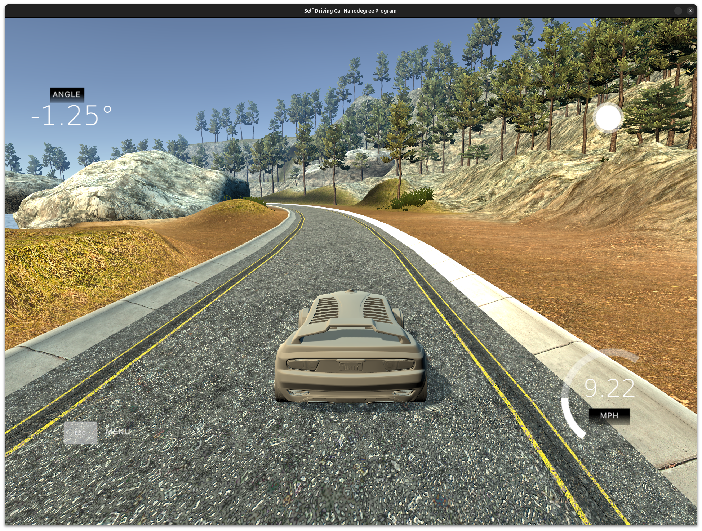
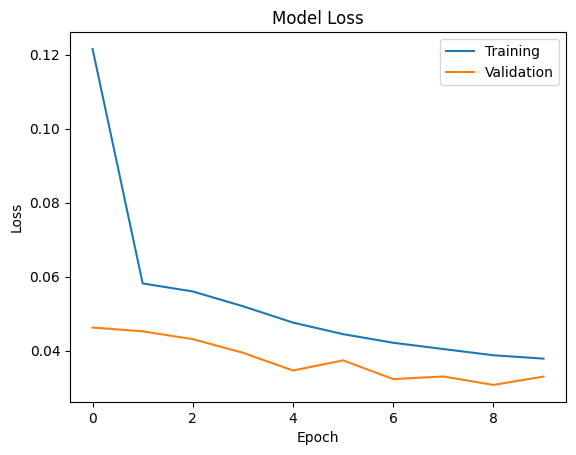

# Self-Driving Car Simulation

[](https://github.com/ethanvillalovoz/self-driving-car-simulation/actions/workflows/ci.yml)
[](https://www.python.org/)
[](https://www.tensorflow.org/)
[](LICENSE)

Behavioral cloning pipeline for autonomous driving in the Udacity self-driving car simulator. The project trains an NVIDIA-style convolutional neural network on simulator camera frames, then serves the trained Keras model through a real-time Socket.IO inference server that predicts steering commands from live simulator telemetry.



## What This Project Demonstrates

- Collected simulator telemetry with center, left, and right camera images.
- Balanced steering-angle data to reduce straight-driving bias.
- Applied image augmentation and preprocessing for robust visual learning.
- Trained a convolutional neural network inspired by NVIDIA's end-to-end driving architecture.
- Saved a trained Keras model and used it in autonomous simulator mode.
- Refactored the inference path into testable preprocessing and control functions.

## Results

The notebook trains a steering-angle predictor from simulator images and saves the trained model to `model/model.h5`. The loss curve below shows the model converging during training.



## Project Structure

```text
self-driving-car-simulation/
├── docs/                         # Screenshots, loss curve, artifact notes
├── notebooks/behavioral_cloning.ipynb
│                                  # Data processing, training, and evaluation
├── scripts/download_artifacts.py # Restores release-hosted model/data/simulator
├── tests/                        # Lightweight unit tests for inference logic
├── drive.py                      # Real-time simulator inference server
├── requirements.txt              # Full training/inference dependencies
└── requirements-dev.txt          # Lightweight CI/test dependencies
```

See [docs/data-and-artifacts.md](docs/data-and-artifacts.md) for details on the included dataset, trained model, and simulator artifacts.

## Quick Start

### 1. Clone The Repository

```bash
git clone https://github.com/ethanvillalovoz/self-driving-car-simulation.git
cd self-driving-car-simulation
```

### 2. Create The Python Environment

Conda is recommended because TensorFlow, OpenCV, and simulator tooling can be sensitive to Python versions.

```bash
conda create -n self-driving-car python=3.10 -y
conda activate self-driving-car
pip install -r requirements.txt
```

For CI-style unit tests only, install the lightweight dependency set:

```bash
pip install -r requirements-dev.txt
pytest
```

### 3. Download The Artifacts

The trained model, training data, and Linux simulator are hosted as GitHub Release assets so the repository stays lightweight.

Download only the trained model needed for autonomous mode:

```bash
python scripts/download_artifacts.py --model
```

Download everything needed to retrain and run the Linux simulator:

```bash
python scripts/download_artifacts.py --all
```

### 4. Train Or Inspect The Model

Open and run the notebook:

```bash
jupyter notebook notebooks/behavioral_cloning.ipynb
```

The notebook loads `data/driving_log.csv`, preprocesses the images in `data/IMG/`, trains the CNN, and writes the model to `model/model.h5`.

### 5. Run Autonomous Mode

Start the inference server:

```bash
python drive.py
```

Then open the Udacity simulator, select **Autonomous Mode**, and connect to the server on port `4567`.

## Inference Pipeline

`drive.py` performs the runtime loop:

1. Receives telemetry from the simulator through Socket.IO.
2. Decodes the base64 center-camera image.
3. Crops sky/hood pixels, converts RGB to YUV, blurs, resizes to `200x66`, and normalizes pixels.
4. Runs the trained Keras model to predict steering.
5. Applies the original proportional throttle controller: `1.0 - speed / speed_limit`.
6. Emits steering and throttle commands back to the simulator.

## Verification

Run local checks:

```bash
python -m py_compile drive.py
pytest
```

The GitHub Actions workflow runs these checks on every push and pull request:

- Python syntax compilation for `drive.py`
- Unit tests for image preprocessing, telemetry decoding, and control prediction
- Notebook JSON validation

The full notebook training run is intentionally not executed in CI because it requires heavier TensorFlow/GPU resources and simulator data artifacts.

## Requirements

- Python 3.10
- TensorFlow/Keras
- OpenCV
- NumPy, Pandas, scikit-learn, Matplotlib
- Flask, python-socketio, eventlet
- Udacity self-driving car simulator

The GitHub Release includes the trained model, training data, and a Linux simulator build. macOS and Windows users should download the matching simulator release from the [Udacity simulator repository](https://github.com/udacity/self-driving-car-sim).

## Roadmap

- Add a small scripted training entrypoint alongside the notebook.
- Add evaluation metrics for lane recovery and track completion.
- Support separate train/eval data splits across multiple simulator tracks.
- Add optional model export to the modern `.keras` format.

## References

- [NVIDIA End to End Learning for Self-Driving Cars](https://arxiv.org/abs/1604.07316)
- [Udacity Self-Driving Car Simulator](https://github.com/udacity/self-driving-car-sim)

## Contributing

Contributions are welcome. Please read [CONTRIBUTING.md](CONTRIBUTING.md) before opening an issue or pull request.

## License

This project is licensed under the [MIT License](LICENSE).
